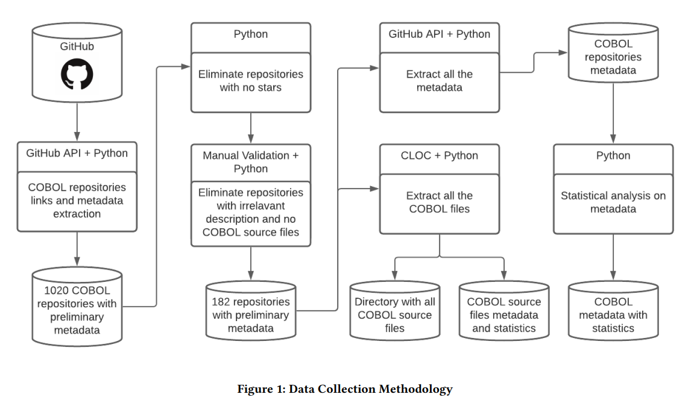
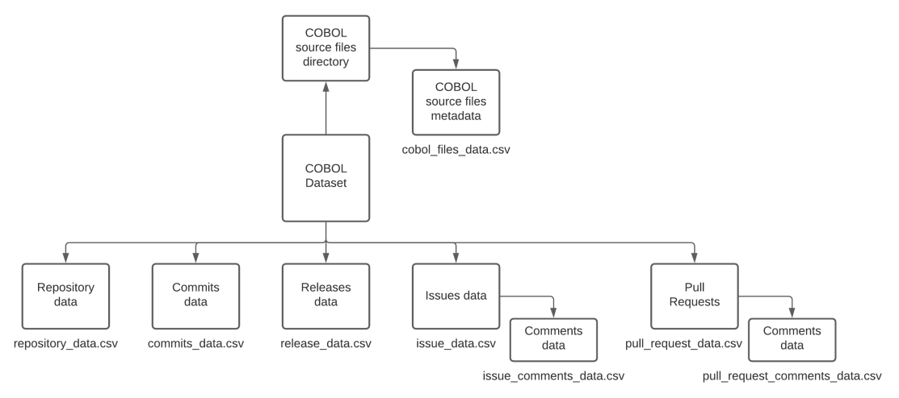
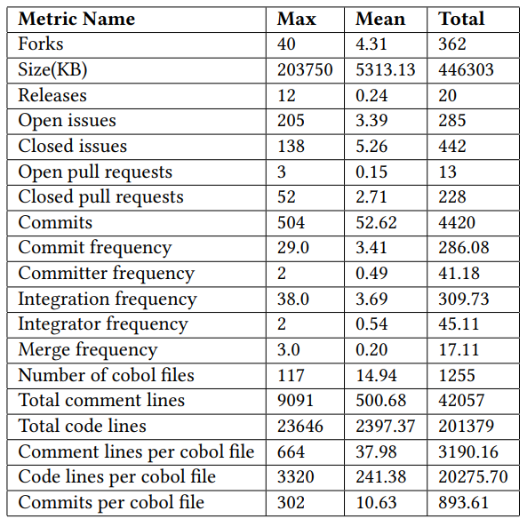
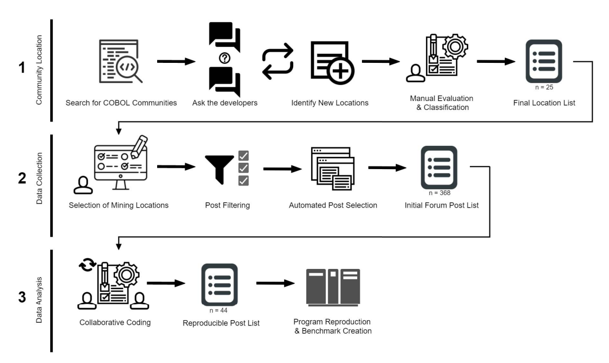
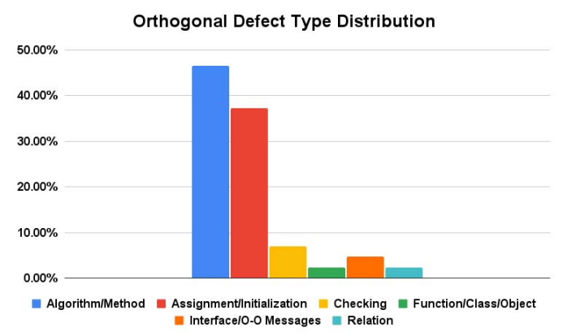

# Dataset COBOL: panoramica strutturata

## 1. Dataset COBOL

### [X-COBOL (2023)](https://arxiv.org/pdf/2306.04892)
 
Dataset costruito tramite mining di repository pubblici. Include circa 84–182 repository e oltre 1200 file COBOL, con metadati di sviluppo (commit, issue, pull request).

**Finalità**
Analisi evolutiva del software, manutenzione e code quality.

**Distribuzione**
Dominata da progetti open-source di piccole e medie dimensioni.

**Bias**
Forte sottorappresentazione di sistemi enterprise reali (assenza quasi totale di CICS, DB2 e batch complessi). Sovra-rappresentazione di codice didattico o dimostrativo.

---

### OpenCBS (Open-Source COBOL Defects Benchmark Suite)

Suite di programmi COBOL contenenti bug, derivati da discussioni tecniche e forum.

**Finalità**
Benchmark per defect detection, debugging e program comprehension.

**Distribuzione**
Programmi piccoli e task-specifici, focalizzati su errori.

**Bias**
Dataset frammentato (snippet ricostruiti), non rappresentativo di sistemi completi. Sovra-rappresenta errori comuni rispetto al codice reale.

---

### [CobolCodeBench](https://github.com/CobolCodeBench/CobolCodeBench-Framework/)
#### Il framework è collegato al relativo dataset

Benchmark derivato da BigCodeBench-Hard, composto da circa 45 task con prompt e soluzioni COBOL.

**Finalità**
Valutazione di modelli LLM su code generation e completion.

**Distribuzione**
Task sintetici, spesso legati a calcoli o data processing.

**Bias**
Dataset completamente sintetico, con semplificazione della semantica enterprise. Anche piccolo <1k

---

### [COBOL Legacy Benchmark Suite](https://github.com/sentientsergio/COBOL-Legacy-Benchmark-Suite?)
##### Generato con claude

Sistema COBOL completo (es. portfolio management), multi-modulo.

**Finalità**
Benchmark per modernizzazione e traduzione automatica.

**Distribuzione**
Limitata a un singolo sistema ma con maggiore complessità rispetto agli altri dataset open.

**Bias**
Dominio specifico (finanza) e natura semi-sintetica.

---

## 2. Dataset COBOL → Java

### [COBOL-JavaTrans](https://arxiv.org/pdf/2604.03986v1)

Dataset bidirezionale per traduzione COBOL ↔ Java, utilizzato in lavori recenti su LLM.

**Finalità**
Valutazione di modelli di traduzione codice.

**Distribuzione**
Coppie curate e filtrate, spesso derivate da pipeline automatiche.

**Bias**
Codice normalizzato e “pulito”, con scarsa rappresentazione di legacy reale.

---
### Legacy COBOL 2024 Corpus
#### Lo hanno usato in Code Reborn, non è pubblico

Corpus di circa 50.000 file COBOL, provenienti da fonti miste (open + enterprise).

**Finalità**
Training e modernizzazione (inclusa traduzione verso Java).

**Distribuzione**
Molto più ampia rispetto ai dataset pubblici standard.

**Bias**
Non pubblico; possibile skew verso domini industriali specifici.

---

## 3. Dataset COBOL → Any

### [COBOLEval](https://github.com/zorse-project/COBOLEval)

Benchmark per task di generazione e trasformazione COBOL.

**Finalità**
Valutazione LLM.

**Distribuzione**
Task sintetici e controllati.

**Bias**
Non rappresenta codice reale; focalizzato su task isolati.

---

### BigCode / CodeSearchNet (subset COBOL)

Dataset multi-linguaggio contenenti anche COBOL.

**Finalità**
Pretraining di modelli generalisti.

**Distribuzione**
COBOL è una frazione molto piccola del totale.

**Bias**
Sottorappresentazione del COBOL e qualità eterogenea.

---

# Tabella riassuntiva

| Dataset                      | Tipo               | Dimensione      | Natura           | Finalità principale        | Livello di realismo | Bias principali                        | Accesso  |
| ---------------------------- | ------------------ | --------------- | ---------------- | -------------------------- | ------------------- | -------------------------------------- | -------- |
| X-COBOL                      | COBOL puro         | ~1255 file      | Open-source      | Evoluzione software        | Basso               | Codice non enterprise, assenza CICS/DB | Pubblico |
| OpenCBS                      | COBOL puro (bug)   | Piccolo         | Ricostruito      | Defect detection           | Medio-basso         | Frammentazione, focus su bug           | Pubblico |
| [CobolCodeBench](https://github.com/CobolCodeBench/CobolCodeBench-Framework/)               | COBOL puro         | ~45 task        | Sintetico        | Benchmark LLM              | Basso               | Task artificiali                       | Pubblico |
| COBOL Legacy Benchmark Suite | COBOL puro         | Sistema singolo | Semi-sintetico   | Modernizzazione            | Medio               | Dominio ristretto                      | Pubblico |
| [COBOL-JavaTrans](https://arxiv.org/pdf/2604.03986v1)              | COBOL→Java         | Non chiaro      | Curato/sintetico | Traduzione LLM             | Medio               | Codice normalizzato                    | Parziale |
| Legacy COBOL 2024 Corpus     | COBOL / traduzione | ~50k file       | Misto            | Training AI                | Alto                | Bias industriale                       | Privato  |
| COBOLEval                    | COBOL→Any          | Piccolo         | Sintetico        | Benchmark LLM              | Basso               | Task isolati                           | Pubblico |
| BigCode / CodeSearchNet      | Multi-lingua       | Molto grande    | Open-source      | Pretraining                | Basso (per COBOL)   | COBOL sottorappresentato               | Pubblico |

---