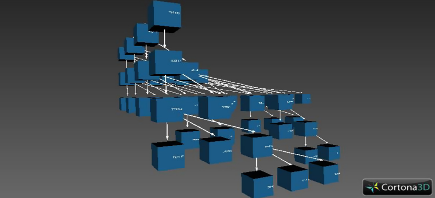
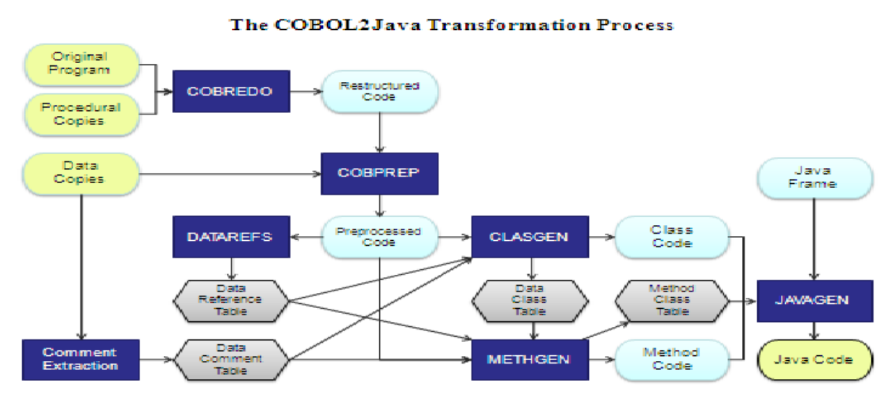
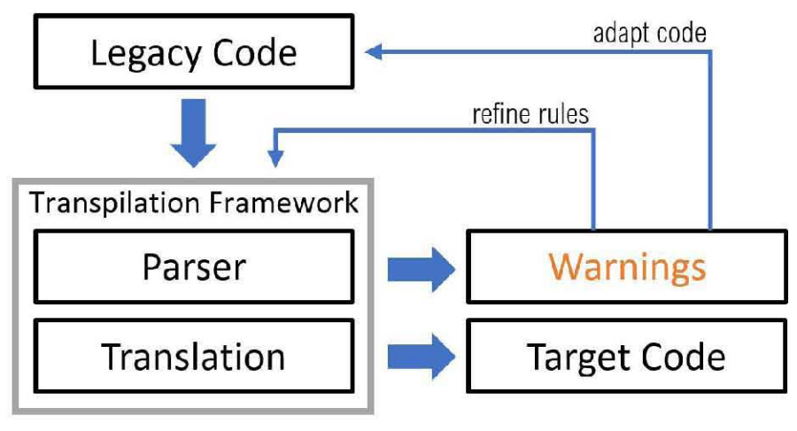

# Feature extraction
## Non Model Driven
### [The effect of 3D visualization on mainframe application maintenance: A controlled experiment](https://www.scopus.com/pages/publications/85015829702?origin=resultslist)

The proposed system aims at establishing a static 3D call graph
model for COBOL programs using virtual reality modeling language. It receives the file having the function source code from
the end user and establishes all functions and sub functions called
by that function as a 3D model using VRML.

### [Lightweight Visualisations of COBOL Codefor Supporting Migration to SOA](https://eceasst.org/index.php/eceasst/article/view/1453/1578)

Based on exist-ing reverse engineering techniques, we provide visualisations to support this processfor COBOL systems and present preliminary results of an ongoing industrial casestudy.

### [A demand-driven approach to slicing legacy COBOL systems](https://www.scopus.com/pages/publications/84863322306?origin=resultslist)
This paperproposes a novel static program slicing approach, which is based on context-sensitive token propagationover control flow graphs (CFGs). CFGs require less space compared with program dependence graphs(PDGs) used by other techniques, and the token propagation method computes the necessary informationonly, on demand. Algorithms are presented for data flow and full slicing to calculate precise program slices.Preliminary application experiences on industrial-scale COBOL systems are also summarized

### [Mining Association Rules from Code (MARC) to support legacy software management](https://www.scopus.com/pages/publications/85077041210?origin=resultslist)
Mining association rules from code (MARC) is a software engineering technique that analyzes source code to identify patterns, dependencies, and relationships between program entities.
This paper presents a methodology for Mining Association Rules from Code (MARC),
aiming at capturing program structure, facilitating system understanding and supporting
software management

### [Multi-language re-documentation to support a COBOL to Java migration project](https://ieeexplore.ieee.org/abstract/document/7884669)
Re-documentation is a subarea of reverseengineering where the intent is to recover lost or non-existentdocumentation in from of a semantically equivalentrepresentation within the same abstraction level such as dataflow, data structure and control flow [7, 8]. These alternativeviews of the software can be generated automatically. Indeed, alot of tools [4, 8, 9] which generate such alternative views fromsource code of legacy systems are available today. Those toolswere successfully used for maintenance of legacy systems [4]as well as support of software migration following anautomatic transformation strategy [8] or manual reimplementation of a legacy system [9]. Also commercial toolssuch as COBOL FGM (www.proetcon.de) generatedependency graphs, data flow graphs, and metrics fromCOBOL source code.

### [COBREX: A Tool for Extracting Business Rules from COBOL](https://ieeexplore.ieee.org/abstract/document/9978206)

Understanding the code that enforcesthe business rules is critical for system evolution. However,this is time-consuming, laborious, and error-prone. Also, thedocumentation of these systems is sometimes inadequate and maybe inconsistent with current organizational policies. Furthermore,the number of current-age developers working on COBOL hasbeen drastically reduced, and they are mainly unfamiliar withlegacy systems. To aid this, we propose a tool called COBREXto extract COBOL business rules using a CFG-based approach.The tool’s main aim is to help the researchers and practitionersto understand COBOL source code by extracting and comprehending the business rules. The demo of the tool can be foundhere - https://youtu.be/3QODmOkISL0 and the details of the toolcan be found here - https://rishalab.github.io/COBREXdoc/.

## Model Driven

### [AI-Native Modernization: Agentic Knowledge Extraction and Code Re-Engineering to Accelerate Developer-Led Transformation](https://www.techrxiv.org/doi/full/10.36227/techrxiv.176425530.08389898)
This paper presents an AI-agent–driven modernizationframework in which cooperating agents continuously minelegacy assets—including COBOL, JCL, SQL, andPL/SQL—extract business rules and data flows, andorganize them into domain concepts that architects anddevelopers can act on. The agents recommendmicroservice-oriented decompositions and targetarchitectures, generate coding scaffolds with validationand resilience patterns, and auto-create unit and end-to-endtest cases from the discovered logic. An AI ModernizationCo-Pilot provides a conversational workspace where teamscan query this knowledge, request designs, and generatecode and tests during migration and data conversion. Byshifting modernization from ad-hoc SME-driven discoveryto a knowledge-centric, agentic process, the frameworkreduces dependency on individual experts, acceleratesdelivery, and improves the consistency and quality oflarge-scale modernization programs.

### [Enhancing COBOL Code Explanations: A Multi-Agents Approach Using Large Language Models](https://arxiv.org/abs/2507.02182)
Common Business Oriented Language (COBOL) is a programminglanguage used to develop business applications that are widelyadopted by financial, business, and government agencies. Due toits age, complexity, and declining number of COBOL developers,maintaining COBOL codebases is becoming increasingly challenging. In particular, the lack of documentation makes it difficult fornew developers to effectively understand and maintain COBOLsystems. Existing research utilizes large language models (LLMs)to explain the functionality of code snippets. However, COBOLpresents unique challenges due to its architectural and syntacticaldifferences, which often cause its code to exceed the token windowsize of LLMs. In this work, we propose a multi-agent approachthat leverages two LLM-based agents working collaboratively togenerate explanations for functions, files, and the overall project.These agents incorporate together by utilizing contextual information from the codebase into the code explanation prompts. Weevaluate the effectiveness of our approach using 14 open-source,real-world COBOL projects. Our results indicate that our approachperforms significantly better than the baseline in function codeexplanation, with improvements of 12.67%, 18.59%, and 0.62% interms of METEOR, chrF, and SentenceBERT scores, respectively.At the file level, our approach effectively explains both short andlong COBOL files that exceed the token window size of LLMs andsurpass the baseline by 4.21%, 10.72%, and 14.68% in explaining thepurpose, functionality, and clarity of the generated explanation. Atthe project level, our approach generates explanations that conveythe functionality and purpose of 82% of the selected projects.

# Migration Strategies and Methods
## Non Model-Based
### [Bottom-up and top-down cobol system migration to web services](https://www.scopus.com/pages/publications/84875739471?origin=resultslist)
Moving from mainframe systems to a service-oriented architecture (SOA)
using Web services is an attractive but daunting task. The bottom-up or directmigration approach enables the effective modernization of legacy systems to
Web services. Conversely, bringing migration into fruition with the top-down
or indirect-migration approach is more difficult, but it achieves better migration
results. Employing both approaches on the same large enterprise system is
uncommon, which leaves no room for comparison. This article describes the
migration processes, costs, and outcomes of applying both approaches on a
real Cobol system.

### [Re-implementing a legacy system](https://www.scopus.com/pages/publications/85066271675?origin=resultslist)
Re-implementation is one of the alternatives to migrate a legacy software system next to conversion, wrapping and redevelopment. It is a compromise solution between automated conversion and complete redevelopment. The technical architecture can be revised and the code replaced, but the functional architecture – the use cases remains as it was. The challenge of this approach is to preserve the functionality while changing the technical implementation. This approach is taken when conversion is not feasible and redevelopment is too expensive or too great a risk. It entails more than a 1:1 transformation but less than a total rewrite. The same components remain with different contents. In this paper the case for reimplementation is presented and the process described. The tools required to support the process are identified and their use illustrated. Finally, two industrial case studies are presented, one with a VisualAge/ PL/I-DB2 system and one with a COBOL-IMS application.

### [COBOL systems migration to SOA: Assessing antipatterns and complexity](https://www.scopus.com/pages/publications/85064766311?origin=resultslist)
Assessment antipatterns of Web Services’ WSDL documents generated upon the three migration approaches. In
addition, generated Web Services’ interfaces are measured in complexity to attend both comprehension and
interoperability. We apply a metric suite (by Baski & Misra) to measure complexity on services interfaces – i.e.,
WSDL documents.

### [Migrating from COBOL to Java](https://ieeexplore.ieee.org/abstract/document/5609583)

This paper is an industrial report on a project formigrating an airport management system from a Bull mainframeusing COBOL as a programming language and IDS as a databasesystem to a distributed UNIX platform using Java and Oracle.The focus here is on the automated language transformation,performed in three phases – reengineering, conversion andrefinement. The tools used are COBRedo for reengineering theCOBOL code, COB2Java for converting COBOL to Java andJavRedoc for documenting the converted Java code. The paperdescribes the migration process and the tools used in it and thereviews the current state of the project. Keywords: Migration,Reengineering, Legacy systems, COBOL, Java, Object-orientedtransformation.

### [Efficient Platform Migration of a Mainframe Legacy System Using Custom Transpilation](https://ieeexplore.ieee.org/abstract/document/9609183)

In this report, we present the case of an insurance system with1M Source Lines of Code, running on an expensive mainframeand featuring Natural, Cobol, and Assembler code as well asan Adabas database. We elaborate on why state-of-practicemigration strategies were inadequate in this case and introducean alternative methodology, taking into account the limitedbudget for the migration.In this project, we use custom transpilation to translate thelegacy code automatically to another programming language. Incontrast to off-the-shelf transpilers, we implement an iterativelyrefined transpiler that is fine-tuned to the legacy code at hand.The transpiler guides its own development by pointing outinstructions in the legacy code it cannot yet translate. Manualadaptions to the legacy code allow circumventing the implementation of overly complicated translation rules. This ensures thetranspiler and the generated code remain lean and efficient whilebeing able to cope with specific challenges of the system at hand.In the presented industrial case, Natural and Assemblersources were transpiled to Cobol running on Linux, combinedwith some adapted and rewritten Cobol and Java. We illustrateour lessons learned and provide in-depth insights into testingand debugging activities. A comparison with alternative offers byother vendors validates the economic benefits of this approach.

### [Modernization of a legacy codebase](https://www.theseus.fi/bitstream/handle/10024/894263/Ala-Hulkko_Tero.pdf?sequence=2)

#### Nel paper [2025] si tratta come caso studio una migrazione COBOL -> Java

Il paper è sempre basato su metodi non AI, ma nella parte di future developement parlano di integrazione di modelli di intelligenza artificiale

### [Evaluating legacy system migration technologies through empirical studies](https://www.sciencedirect.com/science/article/pii/S0950584908000694)

We present two controlled experiments conducted with master students and practitioners and a casestudy conducted with practitioners to evaluate the use of MELIS (Migration Environment for Legacy Information Systems) for the migration of legacy COBOL programs to the web. MELIS has been developed as anEclipse plug-in within a technology transfer project conducted with a small software company [16]. Thepartner company has developed and marketed in the last 30 years several COBOL systems that need to bemigrated to the web, due to the increasing requests of the customers. The goal of the technology transferproject was to define a systematic migration strategy and the supporting tools to migrate these COBOLsystems to the web and make the partner company an owner of the developed technology. The goal ofthe controlled experiments and case study was to evaluate the effectiveness of introducing MELIS inthe partner company and compare it with traditional software development environments. The resultsof the overall experimentation show that the use of MELIS increases the productivity and reduces thegap between novice and expert software engineers.

### [COB2PY - A Non-AI, Rule-Based COBOL to Python Translator](https://ieeexplore.ieee.org/stamp/stamp.jsp?tp=&arnumber=11186107&tag=1)

### [An Holistic Approach to Migrate Industrial Legacy Systems](https://theses.hal.science/tel-04132315/)
#### [Link al PDF](https://theses.hal.science/tel-04337686v2/preview/These_BRAGAGNOLO_Santiago.pdf#page=2)
This project takes place in the context of a collaboration with BergerLevrault, a large software company providing several services and applications developed with different technologies. In a business-critical quest for technological
unification, cost reduction, and access to new markets, Berger-Levrault started an
extensive program of software modernisation.

### [Discussion Paper: COBOL’s Migration to Modern Technology](https://www.researchgate.net/profile/Marc-Elvin-Cerezo/publication/391992097_Discussion_Paper_COBOL's_Migration_to_Modern_Technology/links/682ffb27026fee1034fa434a/Discussion-Paper-COBOLs-Migration-to-Modern-Technology.pdf)
The discussion paper explores the
possibility of migration of COBOL’s environment to more
modern systems and programming languages, the struggles
and the current situation of COBOL in the modern world. The
background of COBOL will be briefly discussed, the findings
from recent articles will also be discussed and the conclusion

### [Incremental Core Transformation: A Modular First Approach to Legacy Modernization in Banking](https://www.researchgate.net/profile/Ashish-Gaurishankar-Vishwakarma/publication/395386767_Incremental_Core_Transformation_A_Modular_First_Approach_to_Legacy_Modernization_in_Banking/links/68c0d6b207fc6b0e2543b0e4/Incremental-Core-Transformation-A-Modular-First-Approach-to-Legacy-Modernization-in-Banking.pdf)

## Model Based
### [Legacy Modernization with AI - Mainframe modernization](https://arxiv.org/pdf/2512.05375)

### [Generative AI-Driven Legacy System Modernization: Transforming Enterprise Infrastructure Through Automated Code Translation and Refactoring](https://al-kindipublishers.org/index.php/jcsts/article/view/9989)
Legacy  systems  continue  to  form  the  operational  backbone  of  numerous  enterprises  despite  presenting  significant  challenges, including  scalabilityconstraints,  integration  limitations,  and  escalating  maintenance  costs.  Generative  artificial  intelligence, particularly  large  language  models  trained  on  extensive  code  repositories,  offers  unprecedented  capabilities  for  automating critical  aspects  of  legacy  system  modernization.  These  AI-driven  solutions  enable  automated  code  translation  between programming   languages,   comprehensive   documentation   generation,   test   case   creation,   and   intelligent   refactoring recommendations.  Real-world  implementations  across financial  services,  insurance,  and  government  sectors  demonstrate substantial  reductions  in  modernization  timelines  and  resource  requirements  while  maintaining  functional  integrity.  The technology  facilitates  the  transformation  of  monolithic  architectures into  modern  microservices,  bridges  skill  gaps  created  by retiring legacy experts, and enables continuous modernization rather than disruptive system replacements. However, successfulimplementation  requires  careful  consideration  of  model  hallucination  risks,  security  protocols,  and  organizational  readiness.  A phased  implementation  framework  combining  AI  capabilities  with  human  expertise  and  robust  governance  structures  emerges as the optimal path forward. This convergence of generative AI and legacy modernization represents a fundamental shift in how enterprises  approach  digital  transformation,  offering  a  more  efficient,  cost-effective,  and  sustainable  alternative  to  traditional modernization methodologies

### [Modernizing Legacy Mainframe Applications to Java in the Cloud: A Full-Stack Testing, AI, and Data Migration Approach](https://papers.ssrn.com/sol3/papers.cfm?abstract_id=5779762)

This paper presents a methodology integrating full-stack testing, test automation (AccelQ, Selenium), Python scripting, AI-driven validation (Watsonx), and ETL-based data migration validation (IBM DataStage, PowerBuilder). Led by Anirudh (Ani) Girey, it ensures high-quality migrations, preserves data integrity, and delivers measurable business value while enabling global team collaboration.

### [Leveraging LLMs for Automated Translation of Legacy Code: A Case Study on PL/SQL to Java Transformation](https://www.scopus.com/pages/publications/105027178802?origin=resultslist)

### [Translation of Low-Resource COBOL to Logically Correct and Readable Java leveraging High-Resource Java Refinement](https://www.scopus.com/pages/publications/85205912130?origin=resultslist)

To address these challenges,
we propose an LLM-based workflow, leveraging temperature sampling and refinement-based strategies, to not only ensure logical
correctness of the translation but also maximize the readability of
the target Java code. We exploit the fact that, due to their extensive exposure to human-written Java codes during pre-training,
the LLMs are more equipped with profound comprehension and
capability for refining translated Java codes than COBOL to Java
translation. 

### [Code Reborn AI-Driven Legacy Systems Modernization from COBOL to Java](https://arxiv.org/abs/2504.11335)
Articolo presente nella prima presentazione

# Altro

## Varie
### [The Code Modernization Playbook](https://resources.anthropic.com/hubfs/Code%20Modernization%20Playbook.pdf)

## Dataset, Benchmark e Test
### [X-COBOL: A Dataset of COBOL Repositories](https://arxiv.org/abs/2306.04892)
### [OpenCBS: An Open-Source COBOL Defects Benchmark Suite](https://ieeexplore.ieee.org/abstract/document/9978243)

### [CODEMENV: Benchmarking Large Language Models on Code Migration](https://aclanthology.org/2025.findings-acl.140.pdf)

### [cobol-to-java-dataset](https://huggingface.co/datasets/Satya25/cobol-to-java-dataset)

### [On the Evaluation of Neural Code Translation: Taxonomy and Benchmark](https://ieeexplore.ieee.org/abstract/document/10298408)
In recent years, neural code translation has gainedincreasing attention. While most of the research focuses onimproving model architectures and training processes, we noticethat the evaluation process and benchmark for code translationmodels are severely limited: they primarily treat source codeas natural languages and provide a holistic accuracy scorewhile disregarding the full spectrum of model capabilities acrossdifferent translation types and complexity. In this paper, wepresent a comprehensive investigation of four state-of-the-artmodels and analyze in-depth the advantages and limitations ofthree existing benchmarks. Based on the empirical results, wedevelop a taxonomy that categorizes code translation tasks intofour primary types according to their complexity and knowledgedependence: token level (type 1), syntactic level (type 2), librarylevel (type 3), and algorithm level (type 4). We then conduct athorough analysis of how existing approaches perform acrossthese four categories

### [Generating Test Suites to Validate Legacy Systems](https://d1wqtxts1xzle7.cloudfront.net/79358475/978-3-030-30690-8-libre.pdf?1642864565=&response-content-disposition=inline%3B+filename%3DSystem_Analysis_and_Modeling_Languages_M.pdf&Expires=1770119515&Signature=YtgKGXTs6lEAKhMT6GXdTXU0EoHvTwgvU8tRzNbipxlzRuvkmkBWufLEfRdoIns9Q~POBHSxFBzzK7mm6tMVL~vh8UrV5TG0RWZdJFvbnQNHcjtSPOiIJpZorulWXBp-2D986xKs3HnZUZbfDCue3sVhw4o-tKQO9T2RA9Fv8eTSdwv7jHg0XZ~H7pQH7iXrkUP5YKVJgo2W6guWJk90VfGr2JYRu0uhiZlOvuPM1q-LPVTsi7d4Yp6tl9B0PN~VKEqGvIr3VoISEob42XO8dqml8t0IQA73gIBTrkKd-pJo5cHXGu1yl77LS95ShFfC8UGBJioBjfdDNc3osGPF5w__&Key-Pair-Id=APKAJLOHF5GGSLRBV4ZA#page=13)

Da pagina 13, sono 267 pagine di volume

### [Automatically Testing Functional Properties of Code Translation Models](https://ojs.aaai.org/index.php/AAAI/article/view/30097)
In this paper, we automatically testfunctional properties of code translation models themselves. To this end, we extend NOMOS (Christakis et al.2023), an open-source framework for expressing functionalcorrectness properties of machine learning models and automatically testing models against these properties. In particular, NOMOS uses a declarative, domain-agnostic specification language for writing hyperproperties (Clarkson andSchneider 2008) (or k-safety properties), which capturefunctional correctness by reasoning about k model executions. As an example, consider a recidivism-risk model predicting whether a criminal is likely to re-offend. The property that “if a criminal’s number of priors increases, thentheir recidivism risk should not decrease” is a 2-safety property—we need two model executions to detect a violation ofthis property, both of which take as input the same criminal but one with an increased number of priors. NOMOS hasbeen used to effectively test models from various applicationdomains, namely action policies as well as models that takeas input tabular data, images, speech, and natural language.

### [Quality Evaluation of COBOL to Java Code Transformation](https://arxiv.org/abs/2507.23356)
We present an automated evaluation system forassessing COBOL-to-Java code translation within IBM’s watsonxCode Assistant for Z (WCA4Z). The system addresses keychallenges in evaluating LLM-based translators, including modelopacity and the complexity of translation quality assessment.Our approach combines analytic checkers with LLM-as-a-judge(LaaJ) techniques to deliver scalable, multi-faceted evaluations.The system supports continuous integration workflows, enableslarge-scale benchmarking, and reduces reliance on manual review. We describe the system architecture, evaluation strategies,and reporting mechanisms that provide actionable insights fordevelopers and project managers, facilitating the evolution ofhigh-quality, modernized codebases.

### [Automated Validation of COBOL to Java Transformation](https://dl.acm.org/doi/abs/10.1145/3691620.3695365)
Questa stava anche nella prima presentazione

### [XTest: A Parallel Multilingual Corpus with Test Cases for Code Translation and Its Evaluation](https://ieeexplore.ieee.org/abstract/document/10055851)
This paper introduces XTest: A ParallelMultilingual Corpus with Test Cases for Code Translation. Ourdataset contains parallel programs in 9 languages, Problemstatement and test cases. Also in this work, we have built 30systems to translate code between some high-resourced(C++,Python, etc) and low-resourced (Go, Ruby, etc) programminglanguages

## Re-Ingegnerizzazione
### [Agile model-driven re-engineering](https://www.scopus.com/pages/publications/85196291052?origin=resultslist)
The objective is to support the reuse of business-critical functionality from such systems and the porting of legacy
code to modernised platforms, together with technical debt reduction to improve the system maintainability and extend
its useful life. AMDRE uses a lightweight MDE process which involves the automated abstraction of software systems
to UML specifications and the interactive application of refactoring and rearchitecting transformations to remove quality
flaws and architectural flaws

### [COBOL Systems Migration to SOA: Assessing Antipatterns and Complexity](https://www.itc.ktu.lt/index.php/ITC/article/view/21566)

### [Evaluating perturbation robustness of generative systems that use COBOL code inputs](https://arxiv.org/abs/2511.18488)
Systems incorporating large language models (LLMs) as a component are known to be sensitive (i.e., non-robust) to minor inputvariations that do not change the meaning of the input; such sensitivity may reduce the system’s usefulness. Here, we present aframework to evaluate robustness of systems using COBOL code asinput; our application is translation between COBOL and Java programming languages, but the approach extends to other tasks suchas code generation or explanation. Targeting robustness of systemswith COBOL as input is essential yet challenging. Many businesscritical applications are written in COBOL, yet these are typicallyproprietary legacy applications and their code is unavailable toLLMs for training. We develop a library of COBOL paragraph andfull-program perturbation methods, and create variant-expandedversions of a benchmark dataset of examples for a specific task.The robustness of the LLM-based system is evaluated by measuringchanges in values of individual and aggregate metrics calculated onthe system’s outputs. Finally, we present a series of dynamic tableand chart visualization dashboards that assist in debugging the system’s outputs, and monitoring and understanding root causes of thesystem’s sensitivity to input variation. These tools can be furtherused to improve the system by, for instance, indicating variationsthat should be handled by pre-processing steps.

## Translation

### [Cross-lingual Transfer in Programming Languages: An Extensive Empirical Study](https://arxiv.org/pdf/2310.16937)

## Refactoring

### [AI-Driven Code Optimization: Leveraging ML to Refactor Legacy Codebases](https://najer.org/najer/article/view/115)
This paper explores the role of AI-driven approaches in modernizing legacy systems, focusing on how ML models can analyze code structures, detect inefficiencies, and generate optimized refactored versions while preserving functionality. We discussvarious AI-based  tools  and  techniques,  such  as  deep  learning  models  for  code  transformation,  reinforcement  learning  for performance optimization, and intelligent code review systems. Additionally, we examine real-world implementations of AI-driven refactoring, outlining its benefits, challenges, and future directions.

## Post-Migrazione

### [Automated Code Transformations: Dealing with the Aftermath](https://ieeexplore.ieee.org/stamp/stamp.jsp?tp=&arnumber=9054813)
This paper looks at three different cases of automated code
transformation at different stages of their lifecycle, highlights
the lessons learned and derives a number of recommendations
that should be useful for planning and executing future transformations.

# Scartati

### [Legacy system migration approaches](https://www.scopus.com/pages/publications/84879919631?origin=resultslist)

L'articolo è in spagnolo, comunque parla di sistemi di migrazione diretta e indiretta, nel caso dalla tabella qualcosa si può recuperare

### [Migration of non-decomposable software systems to the Web using screen proxies](https://web.archive.org/web/20170808200507id_/http://foswiki.cs.uu.nl/foswiki/pub/MethodEngineering/EclipseBasedMigrationLegacy20122013/20270165.pdf)
#### L'articolo non parla della migrazione del cobol ma del reindirizzamento delle richieste da frontend mediante proxy

This paper proposes an approach for migrating a
non-decomposable software system. The approach consists
of redirecting the request of input/output operations to the
legacy system by using screen and database proxies. The
approach has been applied successfully to Cobol software
systems with a character-based user interface.

### [GlueTest: Testing Code Translation via Language Interoperability](https://ieeexplore.ieee.org/abstract/document/10794998)
Da vedere quanto è utile, uscito sulla ricerca perché cita uno degli articoli considerati sopra