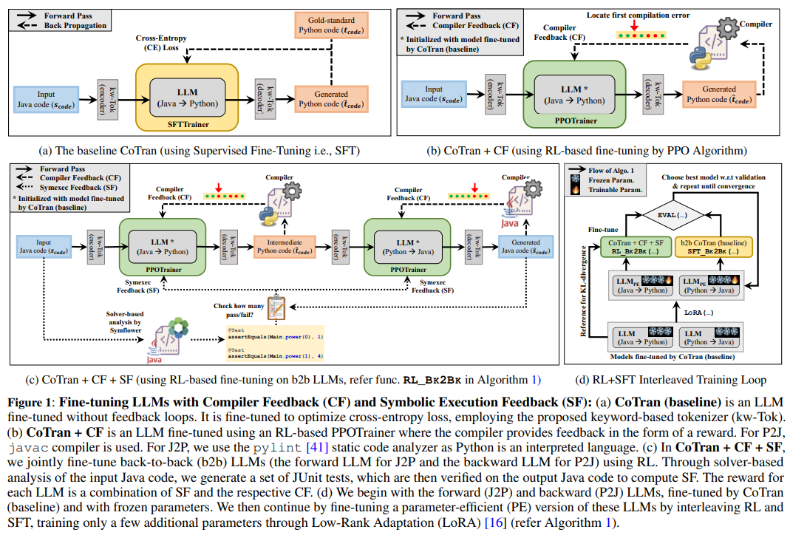

# Feature Extraction
## Model Driven

### [Data model reverse engineering in migrating a legacy system to Java](https://www.scopus.com/pages/publications/57749194202?origin=resultslist)
Central to any legacy migration project is the translationof the data model. Decisions made here will have strongimplications to the rest of the translation. Some legacy languages lack a structured data model, relying instead on explicit programmer control of the overlay of variables. Inthis paper we present our experience inferring a structureddata model in such a language as part of a migration ofeight million lines of code to Java. We discuss the commonidioms of coding that were observed and give an overviewof our solution to this problem.

# Migration
## Non Model Driven
### [Software Evolution of Legacy Systems](https://eprints.staffs.ac.uk/2770/1/ICEIS_2016_Volume_1.pdf#page=434)
we describe a case study of an actual platform
migration, along with pitfalls and lessons learned. This paper thus aims to give software practitioners—both
resource-allocating managers and choice-weighing engineers—a general framework with which to tackle software evolution and a specific evolution case study in a frequently-encountered Java-based setup.

### [C to Java Migration Experiences](https://ieeexplore.ieee.org/stamp/stamp.jsp?tp=&arnumber=995799)
In this paper, we present theEphedra approach to software migration and report on theresults of three case studies transliterating C source code toJava using the Ephedra environment.

### [Migrating legacy engineering applications to Java](https://dl.acm.org/doi/abs/10.1145/604251.604260)
Paper sulla migrazione C e Fortran 

### [Quality-Driven Microservice Refactoring of Legacy Java Systems: Patterns, Automation, and Migration Challenges](https://urfjournals.org/open-access/quality-driven-microservice-refactoring-of-legacy-java-systems-patterns-automation-and-migration-challenges.pdf)
Parte da Java, il sistema di pattern e refactoring sono utilizzabili

### [A Survey on Survey of Migration of Legacy Systems](https://dl.acm.org/doi/abs/10.1145/2980258.2980409)
#### Tratta praticamente tutto, anche in maniera abbastanza estensiva, compresa la parte di test

## Model Driven

### [CoTran: An LLM-Based Code Translator Using Reinforcement Learning with Feedback from Compiler and Symbolic Execution](https://www.scopus.com/pages/publications/85216664724?origin=resultslist)

In this paper, we present an LLM-based code translation method and an associated tool called CoTran, that translateswhole-programs from one high-level programming language to another. Existing LLM-based code translation methods lack training toensure that the translated code reliably compiles or bears substantialfunctional equivalence to the input code. In our work, we fine-tunean LLM using reinforcement learning, incorporating compiler feedback, and symbolic execution (symexec)-based testing feedback toassess functional equivalence between the input and output programs.

### [Migrating legacy data structures based on variable overlay to Java](https://www.scopus.com/pages/publications/77950140887?origin=resultslist)
Legacy information systems, such as banking systems, are usually organized around their data model. Hence, when these systems are migrated to modern environments, translation of the data model involves the most critical decisions, having strong implications on the rest of the translation. In this paper, we report our experience and describe the approaches adopted in migrating a large banking system (ten million lines of code) to Java, starting from a proprietary data model which gives programmers explicit control of the variable overlay in memory. After presenting the basic translation scheme, we discuss the exceptions that may occur in practice. Then, we consider two heuristic approaches useful to reduce the number of cases where a behavior equivalent to that of unions must be reproduced in Java. Finally, we comment on the experimental results obtained so far.

### [AlphaTrans: A Neuro-Symbolic Compositional Approach for Repository-Level Code Translation and Validation](https://dl.acm.org/doi/abs/10.1145/3729379)
#### Da vedere dove mettere perché non tratta propriamente né java ne altro (potrebbe andare nel deliverable AI)
We propose AlphaTrans, aneuro-symbolic approach to automate repository-level code translation. AlphaTrans translates both sourceand test code, and employs multiple levels of validation to ensure the translation preserves the functionalityof the source program. To break down the problem for LLMs, AlphaTrans leverages program analysis todecompose the program into fragments and translates them in the reverse call order.We leveraged AlphaTrans to translate ten real-world open-source projects consisting of ⟨836, 8575, 2719⟩(application and test) classes, (application and test) methods, and unit tests. AlphaTrans breaks down theseprojects into 17874 fragments and translates the entire repository. 96.40% of the translated fragments aresyntactically correct, and AlphaTrans validates the translations’ runtime behavior and functional correctnessfor 27.03% and 25.14% of the application method fragments

### [Exploring and Unleashing the Power of Large Language Models in Automated Code Translation](https://dl.acm.org/doi/pdf/10.1145/3660778)
we further propose UniTrans, a Unified code Translation framework,applicable to various LLMs, for unleashing their power in this field. Specifically, UniTrans first crafts aseries of test cases for target programs with the assistance of source programs. Next, it harnesses the aboveauto-generated test cases to augment the code translation and then evaluate their correctness via execution.Afterward, UniTrans further (iteratively) repairs incorrectly translated programs prompted by test caseexecution results.

# Prompt Engineering

### [Leveraging LLMs for Automated Translation of Legacy Code: A Case Study on PL/SQL to Java Transformation](https://www.scopus.com/pages/publications/105027178802?origin=resultslist)
The VT legacy system, comprising approximately 2.5 million lines of PL/SQL code, lacks consistent documentation and automated tests, posing significant challenges for refactoring and modernisation. This study investigates the feasibility of leveraging large language models (LLMs) to assist in translating PL/SQL code into Java for the modernised "VTF3"system. By leveraging a dataset comprising 10 PL/SQL-to-Java code pairs and 15 Java classes, which collectively established a domain model for the translated files, multiple LLMs were evaluated. Furthermore, we propose a customized prompting strategy that integrates chain-of-guidance reasoning with n-shot prompting. 

# Testing

### [Formal Verification of Transcompiled Mobile Applications Using First-Order Logic](https://www.scopus.com/pages/publications/105026452126?origin=resultslist)
#### Nel paper viene specificato che il framework è language-agnostic
The increasing interest in automated code conversion and transcompilation—driven by the need to support multiple platforms efficiently—has raised new challenges in verifying that translated codes preserve the intended behaviors of the originals. Although it has not yet been widely adopted, transcompilation offers promising applications in software reuse and cross-platform migration. With the growing use of Large Language Models (LLMs) in code translation, where internal reasoning remains inaccessible, verifying the equivalence of their generated outputs has become increasingly essential.

### [Leveraging Automated Unit Tests for Unsupervised Code Translation](https://arxiv.org/abs/2110.06773)
With little to no parallel data available for programming languages, unsupervisedmethods are well-suited to source code translation. However, the majority of unsupervised machine translation approaches rely on back-translation, a method developed in the context of natural language translation and one that inherently involvestraining on noisy inputs. Unfortunately, source code is highly sensitive to smallchanges; a single token can result in compilation failures or erroneous programs,unlike natural languages where small inaccuracies may not change the meaning ofa sentence. To address this issue, we propose to leverage an automated unit-testingsystem to filter out invalid translations, thereby creating a fully tested parallel corpus. We found that fine-tuning an unsupervised model with this filtered data setsignificantly reduces the noise in the translations so-generated, comfortably outperforming the state-of-the-art for all language pairs studied. In particular, forJava → Python and Python → C++ we outperform the best previous methods bymore than 16% and 24% respectively, reducing the error rate by more than 35%.

### [Testing-based translation validation of generated code in the context of IEC 61508](https://link.springer.com/article/10.1007/s10703-009-0082-0)
#### Con model-based non intendono basato su AI, ma su programmazione a blocchi. 
Production code generation with Model-Based Design has successfully replacedmanual coding across various industries and application domains. Furthermore, code generated from executable graphical models is increasingly being deployed in high-integrityembedded applications.To validate the model-to-code translation process, generated software components and itsprecursory stages (i.e. models) should be subjected to an appropriate combination of qualityassurance measures. For high-integrity applications, compliance with safety standards suchas IEC 61508 needs to be demonstrated as well.

### [Mutation analysis for evaluating code translation](https://link.springer.com/article/10.1007/s10664-023-10385-w)
Source-to-source code translation automatically translates a program from one programming language to another. The existing research on code translation evaluates the effectiveness of their approaches by using either syntactic similarities (e.g., BLEU score), or test execution results. The former does not consider semantics, the latter considers semantics but falls short on the problem of insufficient data and tests. In this paper, we propose MBTA (Mutation-based Code Translation Analysis), a novel application of mutation analysis for code translation assessment.

# Db Related
### [Correct by construction approach for translation of stored procedures to Java code](https://www.scopus.com/pages/publications/85123042034?origin=resultslist)

### [Data Model Reverse Engineering in Migrating a Legacy System to Java](https://ieeexplore.ieee.org/abstract/document/4656407)
Inthis paper we present our experience inferring a structureddata model in such a language as part of a migration ofeight million lines of code to Java. We discuss the commonidioms of coding that were observed and give an overviewof our solution to this problem.

# Refactoring
### [Refactoring Legacy Code: Migrating to Java Streams for a Functional Programming Approach](https://www.researchgate.net/profile/Juliana-George/publication/389628193_Refactoring_Legacy_Code_Migrating_to_Java_Streams_for_a_Functional_Programming_Approach/links/67ca21a8e62c604a0dd5c2a2/Refactoring-Legacy-Code-Migrating-to-Java-Streams-for-a-Functional-Programming-Approach.pdf)

# Benchmark
### [Migration Performance for Legacy Data Access](https://ijdc.net/ijdc/article/view/59)
We present performance data relating to the use of migration in a system we are creating to provideweb access to heterogeneous  document collections in legacy formats. Our goal is to enablesustained access to collections such as these when faced with increasing obsolescence of thenecessary   supporting   applications   and   operating   systems.   Our   system   allows   searching   andbrowsing of the original files within their original contexts utilizing binary images of the originalmedia. The system uses static and dynamic file migration to enhance collection browsing, andemulation to support both the use of legacy programs to access data and long-term preservation ofthe migration software.

# Altro

### [Towards a Topology for Legacy System Migration](https://dl.acm.org/doi/abs/10.1145/3387940.3391476)
#### Tratta la comunicazione azienda-accademia in relazione alla migrazione di codice legacy
Dealing with legacy systems is a decade old industry challenge. Thepressure to efficiently modernise legacy both to meet new businessrequirements and to mitigate inherent risks is ever growing. Ourexperience shows a lack of collaboration between researchers andpractitioners inhibiting innovation in the field. To facilitate communication between academia and industry and as a byproduct toobtain an up to date picture of the state of affairs we are creating alegacy system migration topology based on generalisations from amulti-case study as well as extensive literature research. We expectthe topology to be useful in connecting industry needs and challenges with current and potential future research and to improvebidirectional accessibility.

### [Better Together? An Evaluation of AI-Supported Code Translation](https://dl.acm.org/doi/pdf/10.1145/3490099.3511157)
#### Analizzano solamente le performances
In a controlled studywith 32 software engineers, we examined whether such imperfectoutputs are helpful in the context of Java-to-Python code translation. When aided by the outputs of a code translation model,participants produced code with fewer errors than when working alone. We also examined how the quality and quantity of AItranslations affected the work process and quality of outcomes, andobserved that providing multiple translations had a larger impacton the translation process than varying the quality of providedtranslations. Our results tell a complex, nuanced story about thebenefits of generative code models and the challenges software engineers face when working with their outputs. Our work motivatesthe need for intelligent user interfaces that help software engineerseffectively work with generative code models in order to understand and evaluate their outputs and achieve superior outcomes toworking alone.