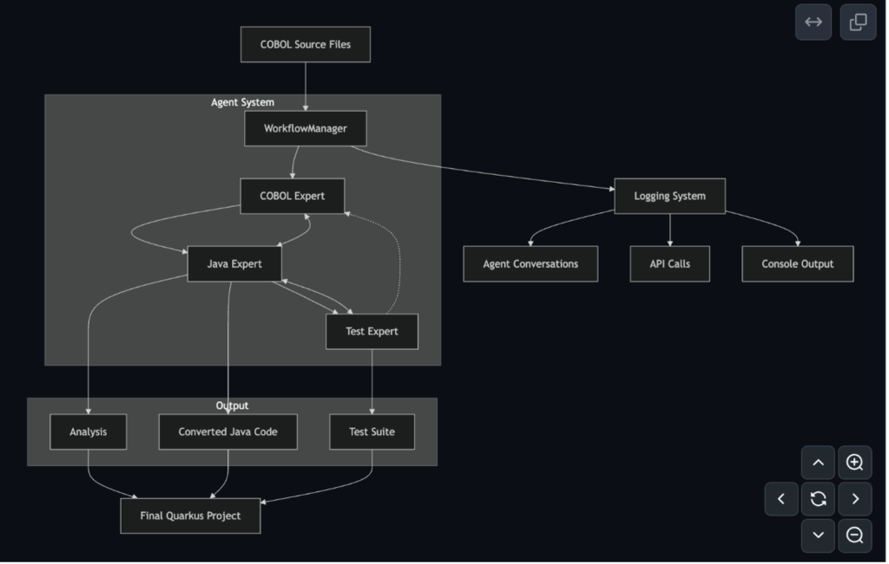

## [How We Use AI Agents for COBOL Migration and Mainframe Modernization](https://devblogs.microsoft.com/all-things-azure/how-we-use-ai-agents-for-cobol-migration-and-mainframe-modernization/)

Il COBOL Agentic Migration Factory (CAMF) è un approccio sviluppato da Microsoft in collaborazione con Bankdata per automatizzare la modernizzazione di sistemi mainframe COBOL verso Java/Quarkus mediante agenti AI orchestrati con Microsoft Semantic Kernel. Il framework nasce dall'esigenza di migrare oltre 70 milioni di righe di codice mantenendo il controllo sulla proprietà intellettuale e riducendo i costi rispetto ai partner esterni.

L'approccio si articola in tre fasi: Preparazione (reverse engineering, pulizia del codice, traduzione commenti), Enrichment (aggiunta commenti significativi, identificazione strutture deterministiche), e Automation Aids (analisi flussi, generazione test, isolamento funzioni utility). L'architettura implementa tre agenti specializzati coordinati da un controller:
Il COBOLAnalyzerAgent estrae semantica del codice mediante prompt AI (struttura programma, variabili, flussi procedurali, statement SQL/DB2, dipendenze copybook), configurato per analisi deterministica su programmi di grandi dimensioni. Il DependencyMapperAgent costruisce il grafo architetturale attraverso due prompt: il primo genera diagrammi Mermaid visualizzando dipendenze con subgraph dinamici; il secondo identifica pattern di data flow, dipendenze circolari e metriche quantitative (complessità, dipendenze medie) che guidano la prioritizzazione della migrazione. Il JavaConverterAgent trasforma il COBOL in Java Quarkus production-ready, gestendo costrutti specifici (PERFORM, GOTO) con cicli strutturati moderni invece di replicare la struttura originale ("JOBOL"), implementando retry logic, sanitizzazione contenuti e parsing intelligente.
Il flusso operativo segue una pipeline sequenziale: (1) scoperta file COBOL/copybook, (2) analisi struttura, (3) mapping dipendenze, (4) conversione a Java, (5) generazione report. L'uso di modelli reasoning come GPT-4.1 garantisce che il codice Java preservi accuratamente la logica business originale. Gli autori evidenziano però che non tutto il COBOL è ugualmente migrabile: moduli legati a comportamenti non funzionali del mainframe (throughput batch, I/O, orchestrazione JCL) richiedono spesso ripensamento architetturale oltre alla conversione. Il progetto è open-source su GitHub con prompt personalizzabili per casi d'uso specifici.

Repository GitHub: https://github.com/Azure-Samples/Legacy-Modernization-Agents

Guida Argon Systems: https://argonsys.com/microsoft-cloud/library/how-we-use-ai-agents-for-cobol-migration-and-mainframe-modernization/

---

## [Automated Testing of COBOL to Java Transformation](https://www.scopus.com/pages/publications/105013962212?origin=resultslist)

---

## [Cross-Language Code Mapping with Transformer Encoder-Decoder Model](https://www.scopus.com/pages/publications/85208057324?origin=resultslist)

---

## [From Monolith to Microservice: Measuring Architecture Maintainability](https://www.scopus.com/pages/publications/85161180737?origin=resultslist)